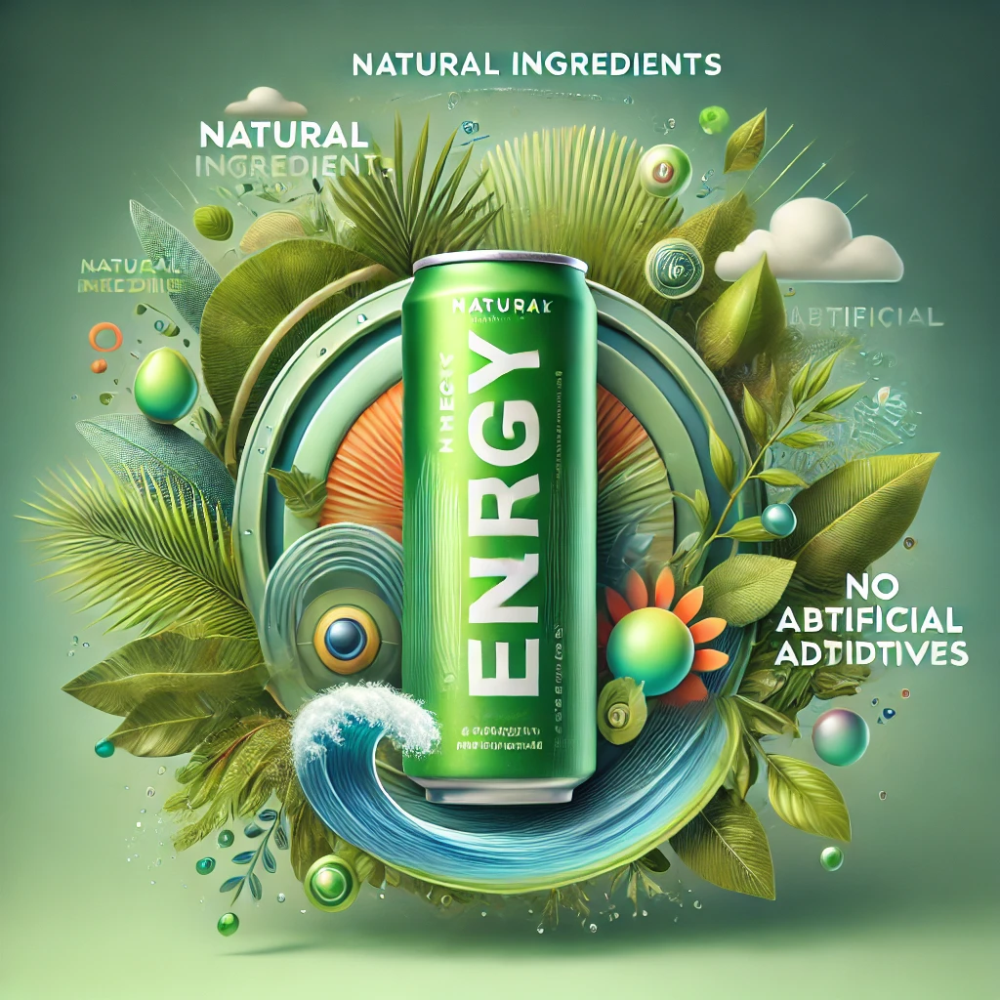

## 1. Natural Ingredients for a Healthier Boost

Our energy drinks are made from carefully selected natural ingredients. Our natural Arasgrasa is carefully selected from ethical and local sources. We believe in offering a healthier alternative to traditional energy drinks, providing you with a boost that aligns with your wellness goals.

## 2. Sustainable Energy Without the Crash

Unlike many other energy drinks, our formula is designed to provide long-lasting energy without the dreaded energy crash. With our Arasgrasa powered range of drinks, you'll feel energized for longer, thanks to the balanced blend of ingredients that release energy gradually.

## 3. No Artificial Additives

We prioritize quality and purity in every can. Our drinks contain **no artificial flavors, colors, or preservatives**. What you get is a natural, clean drink that tastes great without any hidden chemicals.

## 4. Environmentally Conscious Packaging

We're committed to reducing our environmental footprint. Our packaging is made from recycled materials, and we encourage consumers to recycle our cans. Enjoy your drink knowing you're making a better choice for the planet.

## 5. Delicious Flavors You'll Love

Our drinks are not only good for you but also **delicious**. Whether you prefer a tropical burst or a more subtle flavor, we've got a range of options that cater to different tastes while providing the same great benefits.

---

At [Grasapunch](https://www.grasapunch.com), we believe that you don't have to compromise between performance and health. Choose our energy drinks for a natural, delicious, and sustainable boost!
