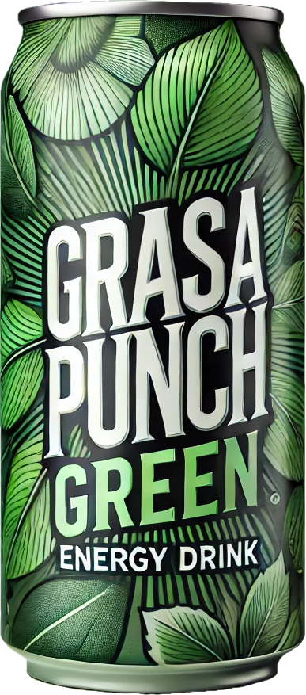
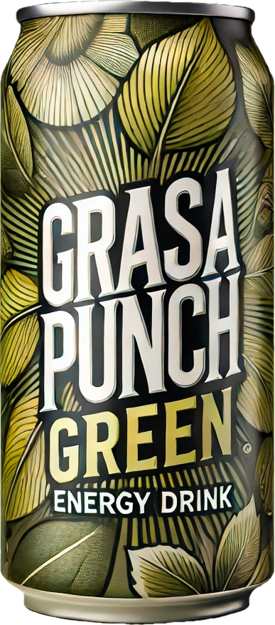

# Discover the GrasaPunch Green Collection: Better Conscience for Better Taste

At **GrasaPunch**, we firmly believe that **"Better conscience for better taste"**. With this philosophy in mind, we have created the **GrasaPunch Green** collection, a range of natural energy drinks combining exquisite flavors and health benefits thanks to our flagship ingredient, **Arasgrasa**.

## Our Featured Products

### **Arasgrasa Mint**

**For freshness taste and power boost**

Price: **€1.5**

Dive into a wave of freshness with Arasgrasa Mint. Infused with natural mint, this drink revitalizes your senses while offering sustainable energy. Ideal for staying fresh and alert throughout the day.

---

### **Arasgrasa Lemon Ginger**

**For a curative effect and power boost**

Price: **€1.5**

Combining the zing of ginger with the liveliness of lemon, Arasgrasa Lemon Ginger is perfect for strengthening your immune system. This natural energy drink helps you stay in shape while offering an explosion of flavors.

---

### **Arasgrasa Aloe Vera**

**For health taste and power boost**

Price: **€1.5**

Discover the benefits of Aloe Vera with this revitalizing drink. Arasgrasa Aloe Vera hydrates your body while providing the energy needed to tackle your daily challenges.

---

## Better Conscience for Better Taste

The **GrasaPunch Green** collection is not just a range of energy drinks; it's a commitment to more responsible and environmentally friendly consumption.

### Why Choose GrasaPunch Green?

- **Natural Ingredients**: Our drinks are made from natural ingredients, without artificial additives.
- **Sustainable Energy**: Thanks to Arasgrasa, benefit from a constant energy supply without the drawbacks of synthetic stimulants.
- **Ecological Commitment**: We adopt sustainable practices to minimize our carbon footprint, from production to packaging.

## Join the GrasaPunch Movement

By choosing GrasaPunch Green, you're opting for a drink that respects your body and the planet. At only **€1.5**, it's a small step for you, but a giant leap towards a healthier and more sustainable lifestyle.

**Available now** in your usual points of sale and on our official website. Don't miss the opportunity to taste the difference a truly natural energy drink makes.

---

For more information, visit our website or follow us on social media. Together, let's make every sip a step towards a better future.
